# L1 Solar Wind Pipeline

Downloads, quality-screens, and combines 1-minute solar wind from **ACE**, **DSCOVR**, and **WIND** into merged time series for SWMF/BATS-R-US upstream boundary conditions.

---

## Installation

```bash
pip install git+https://github.com/connordimarco/meldpy.git
```

## Usage

Run from wherever you want the data to land. `L1/` and `L1_raw/` are created relative to your current directory.

```bash
cd /path/to/my/data
python my_script.py
```

```python
from meldpy import download_day, process_day, create_combined_l1_files
from pyspedas import CDAWeb

cda = CDAWeb()
for day in ('2024-05-09', '2024-05-10', '2024-05-11'):
    download_day(day, cda)   # fetch raw data -> L1_raw/ (skipped if already done)
    process_day(day)         # despike/filter  -> L1/

create_combined_l1_files('2024-05-10', prev_day='2024-05-09', next_day='2024-05-11')
# Outputs: L1/2024/05/10/IMF_14Re.dat, IMF_32Re.dat  (2024-05-10 only)
```

`prev_day`/`next_day` are required for correct results: the combine step needs adjacent days already processed. `download_day` also creates `L1_satpos.dat` -- no separate call needed.

---

## Data Flow

```mermaid
flowchart TD
    subgraph PIPE["l1_pipeline.py  —  Per-Satellite Processing"]
        ACE["ACE · CDAWeb\nAC_H0_MFI  AC_H0_SWE"]
        DSC["DSCOVR · NOAA NGDC\nm1m · f1m"]
        WND["WIND · CDAWeb\nWI_H0_MFI  WI_H1_SWE"]
        DL["Download\nl1_downloaders.py\nCDAWeb API  ·  NOAA NGDC FTP"]
        RD["Read raw files  ·  l1_readers.py\nCDF  ACE WIND  ·  gzipped NetCDF  DSCOVR"]
        RS["Resample to 1-minute grid\nGSE→GSM coordinate rotation  gse_to_gsm\nWIND thermal speed → temperature  K"]
        DS1["despike()  ·  l1_filters.py\n3-point centered median filter\nBx  By  Bz  ·  Ux  Uy  Uz  ·  rho\nshort intra-satellite gaps filled  ≤ 2 min"]
        ACE & DSC & WND --> DL --> RD --> RS --> DS1
    end

    L1R[/"L1_raw/YYYY/MM/DD/\nL1_ace.dat  ·  L1_dscovr.dat  ·  L1_wind.dat\nper-satellite  ·  untouched pre-filter"/]
    L1F[/"L1/YYYY/MM/DD/\nL1_ace.dat  ·  L1_dscovr.dat  ·  L1_wind.dat\nfiltered  ·  GSM\nL1_satpos.dat  —  noon satellite positions  Rₑ"/]

    RS  --> L1R
    DS1 --> L1F

    subgraph COMB["l1_combine.py  —  create_combined_l1_files()"]
        LD["Load per-satellite .dat files\n±1-day context window\nalign all satellites to common 1-min master grid"]
        GF["Cross-boundary gap fill  ·  interpolate_with_limits\nper-satellite on full 3-day window\nB ≤ 5 min  ·  plasma ≤ 60 min  ·  T ≤ 60 min\nbridges trailing/leading edges Stage 1 cannot see"]
        PR["Propagate to common reference position\nread L1_satpos.dat  ·  find satellite closest to Earth  min X\nshift farther satellites forward in time  ballistic_propagation\nall satellites now represent same parcel at x_ref"]

        subgraph QC["score_all_plasma()  ·  l1_quality.py  —  plasma only: Ux  Uy  Uz  rho"]
            Q1["① Outlier detection\nflag odd-one-out when the other two satellites agree\npairwise rolling median  ·  per-variable absolute or ratio threshold"]
            Q2["② Physical range check\nreject implausible values\nUx: −2500 to −150 km/s  ·  rho: 0.1 – 100 cm⁻³\nUy  Uz: ±200 km/s"]
            Q3["③ NaN-fraction check\nflag windows where >50% of points are missing\n60-minute rolling window"]
            Q4["④ Flat-plateau detection\nflag stuck or near-constant instrument readings\nrolling std ≤ threshold  AND  unique-value count ≤ 3"]
            Q5["⑤ Near-zero Uy/Uz  —  DSCOVR only\nFaraday-cup transverse-velocity artifact\n|Uy| or |Uz| ≤ 0.5 km/s while non-NaN"]
        end

        VS["Per-variable satellite selection  ·  Bx  By  Bz  ·  Ux  Uy  Uz  ·  rho\nPlasma: quality bad-masks applied before selection\nMagnetic field: bypasses quality gate\n3 satellites agree within threshold  →  median of all three\n2 satellites agree within threshold  →  mean of closest agreeing pair\nNone agree  →  fallback: closest to previous output  WIND at startup\n  locked source switches only after 3 consecutive minutes of preference"]

        subgraph TC["combine_temperature()  ·  l1_combine_T.py\nT handled independently of B and plasma"]
            T1["① 3-point median  per satellite\nremoves single-minute spikes in each T stream"]
            T2["② Log-std spikiness filter  per satellite\nrolling 11-minute window  ·  log-std > 0.5 → NaN\nrejects DSCOVR multi-minute oscillation episodes"]
            T3["③ Geometric median across available satellites\nexp  median  log T\nno threshold  ·  no source-switching  ·  single code path\n2 sats → geometric mean  ·  3 sats → log-space middle value"]
            T4["④ 3-point rolling median  final pass\nremoves residual minute-level noise from combined T"]
            T1 --> T2 --> T3 --> T4
        end

        ST["smooth_transitions()  ·  l1_filters.py\nboxcar smoothing only at satellite source-switch minutes  plasma only\nC > 20  %  for rho  T  Ux    km/s  for Uy  Uz\nW = round  min  60  C÷5   minutes\nreal solar-wind jumps not smoothed"]
        SL["Slice combined window to target day\nfill residual NaN gaps  linear interpolation  ≤ 30 min"]

        LD  --> GF
        GF  --> PR
        PR  --> QC
        PR  --> T1
        Q1 & Q2 & Q3 & Q4 & Q5 --> VS
        VS  --> ST
        T4  --> ST
        ST  --> SL
    end

    L1C[/"L1/YYYY/MM/DD/  ·  L1_combined.dat\nnSat  —  number of quality-passing satellites contributing Ux each minute"/]

    subgraph PROP["l1_propagation.py  —  Ballistic Propagation"]
        BP["ballistic_propagation()\ntravel time  =  ΔX_GSM  /  Ux\ncausality-enforced monotone time mapping\nfrom x_ref  closest satellite position  to target boundary"]
    end

    IMF14[/"IMF_14Re.dat  —  boundary at X = −14 Rₑ"/]
    IMF32[/"IMF_32Re.dat  —  boundary at X = −32 Rₑ"/]

    L1F --> LD
    SL  --> L1C
    L1C --> BP
    BP  --> IMF14
    BP  --> IMF32
```


---

## File Inventory

| File | Role |
|---|---|
| `l1_pipeline.py` | Download, resample, coordinate rotation, and per-satellite raw/filtered `.dat` output |
| `l1_combine.py` | Multi-satellite merge with quality gating, source selection, and propagation |
| `l1_combine_T.py` | Temperature-specific combiner (see below) |
| `l1_quality.py` | Quality checks and `score_all_plasma()` |
| `l1_filters.py` | `despike()`, `smooth_transitions()`, `median_filter_3()`, `interpolate_with_limits()` |
| `l1_propagation.py` | Ballistic travel-time propagation with causality enforcement |
| `l1_readers.py` | CDF and gzipped NetCDF readers; ASCII `.dat` reader |
| `l1_downloaders.py` | CDAWeb and NOAA NGDC download helpers |

---

## Output Layout

### Raw per-satellite output

`L1_raw/YYYY/MM/DD/`

| File | Description |
|---|---|
| `L1_ace.dat` | ACE 1-min stream before filtering |
| `L1_dscovr.dat` | DSCOVR 1-min stream before filtering |
| `L1_wind.dat` | WIND 1-min stream before filtering |

### Filtered + combined output

`L1/YYYY/MM/DD/`

| File | Description |
|---|---|
| `L1_ace.dat` | ACE 1-min filtered stream (GSM) |
| `L1_dscovr.dat` | DSCOVR 1-min filtered stream (GSM) |
| `L1_wind.dat` | WIND 1-min filtered stream (GSM) |
| `L1_satpos.dat` | Noon GSM positions (Re) for all three satellites |
| `L1_combined.dat` | Merged, quality-screened, unpropagated stream with `nSat` |
| `IMF_14Re.dat` | Combined stream propagated to 14 Re |
| `IMF_32Re.dat` | Combined stream propagated to 32 Re |

`L1_combined.dat` metadata:

- `nSat`: number of satellites contributing valid plasma for `Ux` at that minute

Column layout is compatible with SWMF/BATS-R-US upstream input readers.

---

## Data Sources

| Satellite | Magnetometer | Plasma | Source |
|---|---|---|---|
| ACE | `AC_H0_MFI` (GSM) | `AC_H0_SWE` (GSM) | CDAWeb |
| DSCOVR | NGDC `m1m` (GSM) | NGDC `f1m` (GSM) | NOAA NGDC |
| WIND | `WI_H0_MFI` (GSM) | `WI_H1_SWE` (GSE → GSM) | CDAWeb |

DSCOVR plasma is taken from NOAA NGDC because the CDAWeb Faraday cup plasma product ends around 2019.

---

## Methodology

Full algorithm description in the accompanying manuscript. For tunable parameters, see below.

---

## Tunable Parameters

- Quality thresholds: module-level constants in `l1_quality.py`
- Agreement thresholds (when satellites "agree"): `_switch_threshold()` in `l1_combine.py`
- Fallback hysteresis: `_SWITCH_MIN = 3` in `_select_column_with_continuity()` in `l1_combine.py`
- Transition smoothing: `_CMAX_DEFAULT`, `_WMAX_DEFAULT`, `_RATE_DEFAULT` in `l1_filters.py`
- Filter behavior: `despike()` in `l1_filters.py`
- Temperature combiner: `combine_temperature()` in `l1_combine_T.py`
