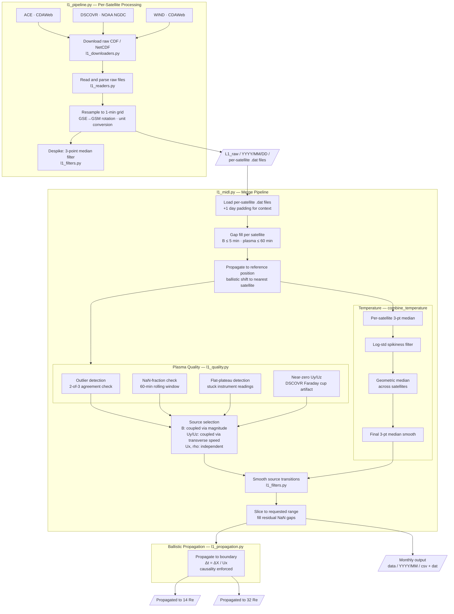

# Multi-Satellite Integrated Dataset from L1 (MIDL)

Downloads, quality-screens, and combines 1-minute solar wind from **ACE**, **DSCOVR**, and **WIND** into merged time series.

---

## Data Flow

---

## File Inventory

| File | Role |
|---|---|
| `l1_midl.py` | **Primary entry point**: `midl(start, end)` continuous pipeline, returns `MIDLResult` |
| `l1_writers.py` | Output formatters: `write_monthly_outputs()` (CSV + DAT) |
| `l1_plot.py` | Debugging plots: `plot_day()`, `plot_variable()` |
| `l1_pipeline.py` | Download, resample, coordinate rotation, and per-satellite raw `.dat` output |
| `l1_combine.py` | Source selection, satellite merging, and temperature combining logic |
| `l1_quality.py` | Quality checks and `score_all_plasma()` |
| `l1_filters.py` | `despike()`, `smooth_transitions()`, `median_filter_3()`, `interpolate_with_limits()` |
| `l1_propagation.py` | Ballistic travel-time propagation with causality enforcement |
| `l1_readers.py` | CDF and gzipped NetCDF readers; ASCII `.dat` reader |
| `l1_downloaders.py` | CDAWeb and NOAA NGDC download helpers |

---

## Output Layout

### Raw per-satellite output

`L1_raw/YYYY/MM/DD/`

| File | Description |
|---|---|
| `L1_ace.dat` | ACE 1-min stream before filtering |
| `L1_dscovr.dat` | DSCOVR 1-min stream before filtering |
| `L1_wind.dat` | WIND 1-min stream before filtering |

### Monthly pipeline output

`data/YYYY/MM/{csv,dat}/`

| File | Description |
|---|---|
| `YYYYMM_unpropagated.{csv,dat}` | Merged stream at reference satellite position. Includes `X_Re` and source provenance columns (`B_source`, `Ux_source`, `Uyz_source`, `rho_source`, `T_source`). Source values are satellite codes: 1=ACE, 2=DSCOVR, 3=WIND, concatenated (e.g. `13` = ACE+WIND). |
| `YYYYMM_14Re.{csv,dat}` | Combined stream propagated to 14 Re |
| `YYYYMM_32Re.{csv,dat}` | Combined stream propagated to 32 Re |

Column layout is compatible with SWMF/BATS-R-US upstream input readers.

---

## Data Sources

| Satellite | Magnetometer | Plasma | Source |
|---|---|---|---|
| ACE | `AC_H0_MFI` (GSM) | `AC_H0_SWE` (GSM) | CDAWeb |
| DSCOVR | NGDC `m1m` (GSE → GSM) | NGDC `f1m` (GSE → GSM) | NOAA NGDC |
| WIND | `WI_H0_MFI` (GSM) | `WI_H1_SWE` (GSE → GSM) | CDAWeb |

DSCOVR plasma is taken from NOAA NGDC because the CDAWeb Faraday cup plasma product ends around 2019.

> **Note:** GSE→GSM coordinate rotation uses spacepy's IGRF geomagnetic field model, which has a finite validity window (currently through 2030 with IGRF14). Processing dates beyond this range requires updating spacepy to a version with newer IGRF coefficients.

---

## Methodology

Full algorithm description in the accompanying manuscript. For tunable parameters, see below.

---

## Tunable Parameters

- Quality thresholds: module-level constants in `l1_quality.py`
- Agreement thresholds (when satellites "agree"): `_switch_threshold()` in `l1_combine.py`
- Fallback hysteresis: `_SWITCH_MIN = 3` in `_select_column_with_continuity()` in `l1_combine.py`
- Transition smoothing: `_CMAX_DEFAULT`, `_WMAX_DEFAULT`, `_RATE_DEFAULT` in `l1_filters.py`
- Filter behavior: `despike()` in `l1_filters.py`
- Temperature combiner: `combine_temperature()` in `l1_combine.py`
