# L1 Solar Wind Pipeline

Downloads, quality-screens, and combines 1-minute solar wind from **ACE**, **DSCOVR**, and **WIND** into merged time series for SWMF/BATS-R-US upstream boundary conditions.

---

## Data Flow

```mermaid
flowchart LR
    subgraph SRC["Data Sources"]
        ACE_s["ACE · CDAWeb\nAC_H0_MFI  AC_H0_SWE"]
        DSC_s["DSCOVR · NOAA NGDC\nm1m · f1m"]
        WND_s["WIND · CDAWeb\nWI_H0_MFI  WI_H1_SWE"]
    end

    subgraph PIPE["l1_pipeline.py — Per-Satellite"]
        DL["Download\nl1_downloaders.py"]
        RD["Read CDF / gzipped-NC\nl1_readers.py"]
        RS["Resample → 1-min grid\nGSE→GSM  ·  vth→T(K)"]
        DS1["despike()\n3-point median\nBx By Bz · Ux Uy Uz · rho"]
        DL --> RD --> RS --> DS1
    end

    L1R[/"L1_raw/YYYY/MM/DD/\nL1_*.dat  untouched"/]
    L1F[/"L1/YYYY/MM/DD/\nL1_*.dat  L1_satpos.dat"/]

    subgraph COMB["l1_combine.py — create_combined_l1_files()"]
        LD["Load filtered .dat files\n±1-day context window"]
        QS["score_all_plasma()  l1_quality.py\n① outlier — odd-one-out when 2-of-3 agree\n② physical range — implausible values\n③ NaN-fraction — data-gap rate in rolling window\n④ flat plateau — stuck instrument readings\n⑤ near-zero Uy/Uz — DSCOVR artifact"]
        VS["Per-variable selection  Bx By Bz · Ux Uy Uz · rho\n3 agree → median\n2 agree → pair mean\n0 agree → closest-to-prev"]
        DS2["despike()\non combined B + plasma stream"]
        CT["combine_temperature()  l1_combine_T.py\n① 3-pt median  ② log-std spikiness filter\n③ geometric median  ④ 3-pt median"]
        SL["Slice to target day\nfill residual NaN gaps"]
        LD --> QS --> VS --> DS2 --> CT --> SL
    end

    L1C[/"L1/YYYY/MM/DD/\nL1_combined.dat  nSat provenance"/]

    subgraph PROP["l1_propagation.py"]
        BP["ballistic_propagation()\ncausality-enforced travel time"]
    end

    IMF14[/"IMF_14Re.dat"/]
    IMF32[/"IMF_32Re.dat"/]

    SRC --> PIPE
    RS  --> L1R
    DS1 --> L1F
    L1F --> LD
    SL  --> L1C
    L1C --> BP
    BP  --> IMF14
    BP  --> IMF32
```

> The standalone source is [`pipeline_flowchart.mmd`](pipeline_flowchart.mmd) — open in [Mermaid Live Editor](https://mermaid.live) to export as PDF or SVG.

---

## File Inventory

| File | Role |
|---|---|
| `l1_pipeline.py` | Download, resample, coordinate rotation, and per-satellite raw/filtered `.dat` output |
| `l1_combine.py` | Multi-satellite merge with quality gating, source selection, and propagation |
| `l1_combine_T.py` | Temperature-specific combiner (see below) |
| `l1_quality.py` | Quality checks and `score_all_plasma()` |
| `l1_filters.py` | `median_filter_3()`, `despike()`, `interpolate_with_limits()` |
| `l1_propagation.py` | Ballistic travel-time propagation with causality enforcement |
| `l1_readers.py` | CDF and gzipped NetCDF readers; ASCII `.dat` reader |
| `l1_downloaders.py` | CDAWeb and NOAA NGDC download helpers |
| `l1_coordinates.py` | GSE → GSM rotation via SpacePy |
| `plot_l1_may2024.py` | Diagnostic 4-column multi-panel plots (raw, filtered, combined, propagated overlay) |
| `l1_example.py` | End-to-end driver script for date ranges (`# %%` cells, VS Code interactive) |
| `pipeline_flowchart.mmd` | Mermaid source for the data-flow diagram above |

---

## Output Layout

### Raw per-satellite output

`L1_raw/YYYY/MM/DD/`

| File | Description |
|---|---|
| `L1_ace.dat` | ACE 1-min stream before filtering |
| `L1_dscovr.dat` | DSCOVR 1-min stream before filtering |
| `L1_wind.dat` | WIND 1-min stream before filtering |

### Filtered + combined output

`L1/YYYY/MM/DD/`

| File | Description |
|---|---|
| `L1_ace.dat` | ACE 1-min filtered stream (GSM) |
| `L1_dscovr.dat` | DSCOVR 1-min filtered stream (GSM) |
| `L1_wind.dat` | WIND 1-min filtered stream (GSM) |
| `L1_satpos.dat` | Noon GSM positions (Re) for all three satellites |
| `L1_combined.dat` | Merged, quality-screened, unpropagated stream with `nSat` |
| `IMF_14Re.dat` | Combined stream propagated to 14 Re |
| `IMF_32Re.dat` | Combined stream propagated to 32 Re |

`L1_combined.dat` metadata:

- `nSat`: number of satellites contributing valid plasma for `Ux` at that minute

Column layout is compatible with SWMF/BATS-R-US upstream input readers.

---

## Data Sources

| Satellite | Magnetometer | Plasma | Source |
|---|---|---|---|
| ACE | `AC_H0_MFI` (GSM) | `AC_H0_SWE` (GSM) | CDAWeb |
| DSCOVR | NGDC `m1m` (GSM) | NGDC `f1m` (GSM) | NOAA NGDC |
| WIND | `WI_H0_MFI` (GSM) | `WI_H1_SWE` (GSE → GSM) | CDAWeb |

DSCOVR plasma is taken from NOAA NGDC because the CDAWeb Faraday cup plasma product ends around 2019.

---

## Filtering

Per-satellite filtering in `despike()` applies a centered **3-point median filter** to `Bx, By, Bz, Ux, Uy, Uz, rho` (not T).

Filtered streams are written to `L1/...`; untouched streams are preserved in `L1_raw/...`.

---

## Quality Checks (`l1_quality.py`)

Applied to **plasma variables only (not B, not T)**. Each satellite/variable/minute receives a boolean bad-mask; flagged values are excluded from the combine step.

1. **Outlier detection**: if two satellites agree and one disagrees, the outlier is flagged.
2. **Physical range**: removes implausible values.
3. **NaN-fraction**: marks windows with poor data completeness.
4. **Flat-plateau**: catches stuck/near-constant instrument readings.
5. **Near-zero Uy/Uz (DSCOVR only)**: catches a known DSCOVR transverse-velocity artifact.

---

## Source Selection (`l1_combine.py`)

After quality gating, each variable is merged minute-by-minute with an agreement-first rule:

- If all 3 satellites agree → median.
- If any 2 satellites agree → mean of that agreeing pair.
- If none agree → satellite closest to the previous output value (WIND preferred at startup).

---

## Temperature (`l1_combine_T.py`)

T is handled separately because it spans orders of magnitude, and real propagation delays between spacecraft are indistinguishable from sensor disagreement. Quality gating on T consistently over-flags during solar wind transitions.

Four steps:
1. **Per-satellite 3-point median** to remove single-minute spikes.
2. **Per-satellite spikiness filter**: rolling log-std over an 11-minute window; minutes exceeding the threshold are excluded (catches DSCOVR oscillation episodes).
3. **Geometric median**: `exp(median(log(T)))` across available satellites. Works correctly at any spread — no threshold, no source-switching. With 2 satellites this is the geometric mean; with 3 it returns the log-space middle value.
4. **3-point rolling median** on the combined result to remove residual minute-level noise.

---

## Plotting

`plot_l1_may2024.py` generates 4-column diagnostic figures:

1. Raw satellites (`L1_raw`)
2. Filtered satellites (`L1`)
3. Combined (`L1_combined.dat`)
4. Combined (black) + propagated overlays (`IMF_14Re.dat` red dotted, `IMF_32Re.dat` blue dotted)

---

## Tunable Parameters

- Quality thresholds: module-level constants in `l1_quality.py`
- Continuity-switch thresholds: `_switch_threshold()` in `l1_combine.py`
- Filter behavior: `despike()` in `l1_filters.py`
- Temperature combiner: `combine_temperature()` in `l1_combine_T.py`
